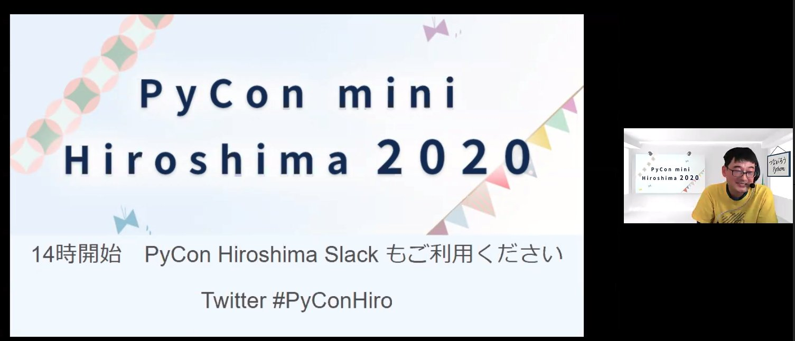
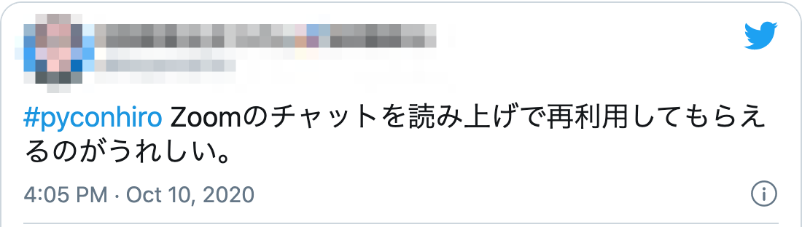
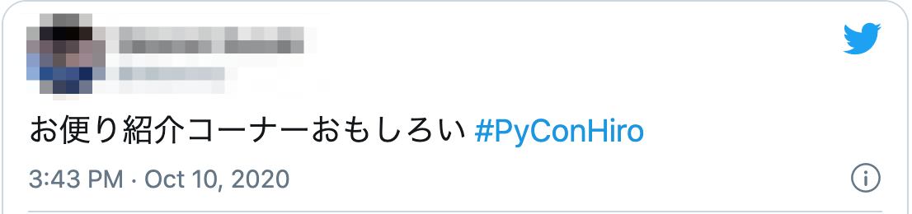
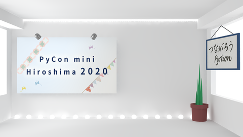
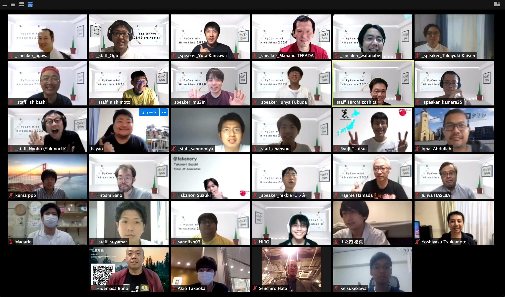

### **2020年、広島の地域 Python コミュニティの挑戦**

中村 優 / @chanyou0311

---

# お前誰よ

- 中村 優 / ちゃんゆー / @chanyou0311
- PyCon mini Hiroshima スタッフ
- OSS Gate サポーター（PyCon JP 2020）
- 株式会社ガイアックス データ分析基盤の構築、運用
- 地元の広島でフルリモートワーク

---

# 今回話すこと

- 地域コミュニティがオンラインイベントを開催して得た教訓を共有
- 何か持ち帰れるものがあれば幸いです

---

# PyCon mini Hiroshima とは

- 広島の Python ユーザーが集って開催する Python のカンファレンス
- 2015年から毎年開催している
- 2020年は「つながろう Python」をテーマに開催した

---

# 開催までのタイムライン

- 2019年11月:  キックオフ
- 5月: 緊急事態宣言等で様子を見ることに
- 6月: オンライン開催 / オフライン開催 / ハイブリッド開催の検討
- 7月: トーク募集開始
- 8月: オンライン開催に決定
- 9月: 細かい調整、集客
- 10月: 開催

---

# イベント当日のタイムスケジュール

| 時間  | 内容                 |
| ----- | -------------------- |
| 14:00 | オープニング         |
| 14:05 | LT                   |
| 14:25 | 基調講演             |
| 14:55 | 休憩（お悩み相談室） |
| 15:00 | セッション           |
| 15:40 | 休憩（お悩み相談室） |
| 16:00 | セッション           |
| 16:40 | 休憩（お悩み相談室） |
| 16:55 | クロージング         |

---

# イベント当日の役割分担

- 司会
- タイムキーパー
- 音声チェック
- Twitter発信
- **Zoom担当**
  - Zoom のスポットライトの切替を担当
- **コメント収集**
  - Zoom、Slack、Twitterのコメントを収集してドキュメントに書き溜める

---

# 無事に完走！

---

# ふりかえり

- YWT（やったこと、わかったこと、次にやること）でふりかえり

---

# やったこと

---

# 休憩時間もコンテンツ化できた

- しゃべり担当2名が表に立って進行
- 事前に収集したコメントを読み上げて、感想を言い合う
- 登壇者も巻き込んで、気になるところを深堀りする

---

# オンラインならではのクリエイティブに挑戦した

- バーチャル背景とジングルを制作した
- 開始前の待機時間やお悩み相談室の切替時に流した
  - ラジオのようだと好評だった

---

# 発表終了時に拍手のSEを入れた

- 登壇者が気持ちよく退場できた

---

# わかったこと / 気づいたこと

---

# よかったこと

- 台風の心配はなかった
  - 毎年10月頃開催していて、台風対応に頭を悩ませていた
- 配信トラブルがなかった
  - 入念にリハーサルしたおかげ
- 距離に関係なく県外から気軽に参加してもらえた

---

# 広島県内からの参加者が少なかった

- 広島県内の参加者が全体の25%程度だった
  - リアルでの呼びかけがうまくできなかった
  - 県外から登壇のハードルは低かった
- パトロン募集をしなかったので地元企業を巻き込みきれなかった点もある

---

## 参加者へのコミュニケーションの促しが
## 十分ではなかった

- Slack ワークスペースが活用しきれなかった
- 懇親会の参加者のほとんどがスタッフと登壇者になってしまった
- 顔見知りの参加者に個別にご挨拶できなかった

---

# 所感

- ふりかえりを踏まえての所感

---

# 地域コミュニティが
# 地域コミュニティたる所以とは何か、
# 考えさせられた1年だった

---

# 広島のコミュニティが広島で開催する意義が問われた

- 毎週地域で開催されている勉強会が PyCon mini Hiroshima と深い関わりがある
  - 「すごい広島」累計395回開催されている
  - 「すごい広島 with Python」PyCon mini Hiroshima 参加者有志が情報交換の場として立ち上げた

---

# 地域との濃い繋がりや定常的な接点はその勉強会でつくられている

- 行き慣れたカフェや美容院のような存在
- PyCon mini Hiroshima はある意味、その勉強会の拡大版ともいえる
  - それこそ地域のお祭りのようなもの

---

## 地域コミュニティが規模の大きなイベントを開くということは、
## 不確実な出会いを生むことではないか

---

## 地域コミュニティは、
## 地域との接点を大事にしながら、不確実な出会いへ背中を押す
## そんな役割が担えるんじゃないか

---

### オンラインかオフラインかは、さほど重要ではなく
### 大規模イベントを開くかどうかも、そこまで重要な話ではないのかも

---

# まとめ

- 地域コミュニティでもオンラインイベントを開催できた
- オンラインに切替えたことで、地域コミュニティの役割を見つめ直すいいきっかけになった

