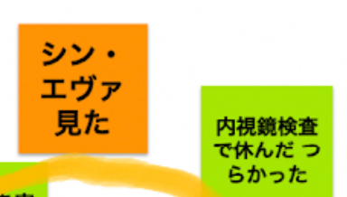
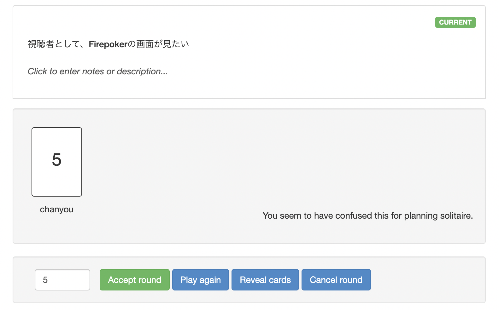
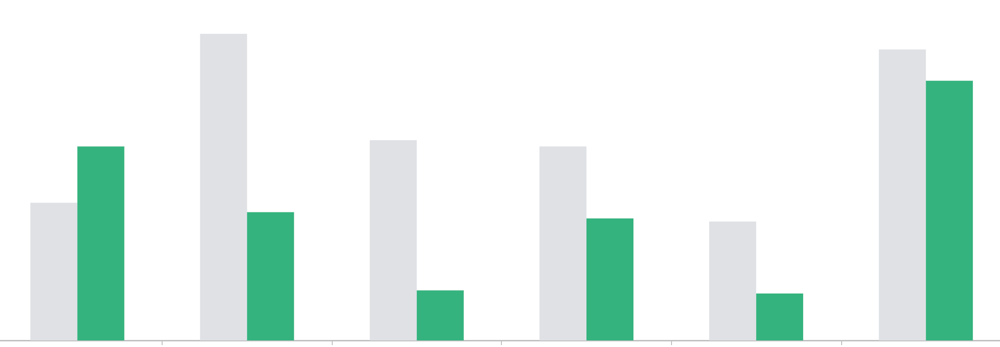
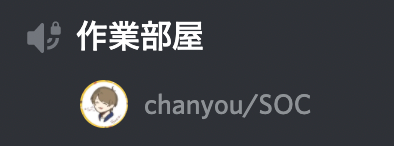
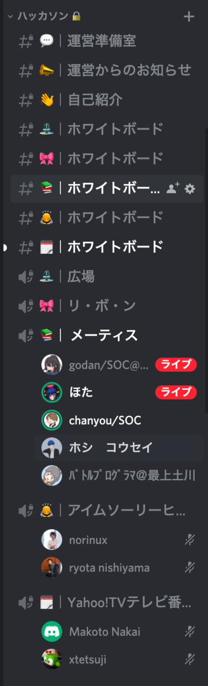
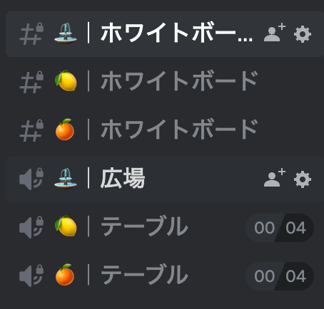
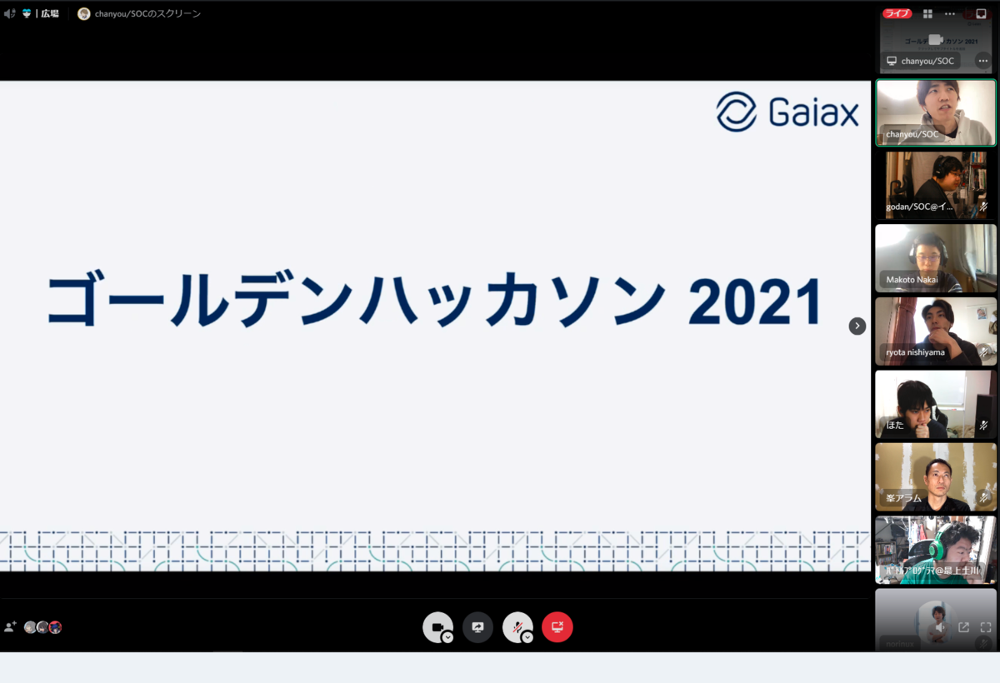
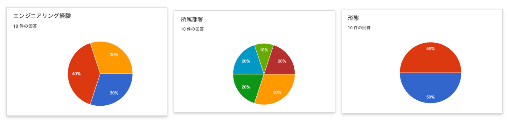

### **フルリモートでもチームを作れる、超えられる！**

中村 優 / @chanyou0311

---

# 中村 優

- ちゃんゆー / @chanyou0311
- 2019年 株式会社ガイアックス新卒入社
- データ分析基盤の構築、運用
- 地元の広島でフルリモートワーク
- 高専出身
- PyCon mini Hiroshima スタッフ

---

### フルリモートでもチームを作れる、超えられる！

- フルリモートにおける仕事の進め方あれこれ

---

# 今日お話すること

- スクラム実践を通してチームを立て直した話
- チームを超えた交流施策として社内ハッカソンをやってみた話

---

# スクラム実践を通してチームを立て直した話

---

# 社内システムの構築や運用をしていた

- エンジニア3名体制
- 業務を効率化する社内システムが分散していた
  - 業務の部分部分を切り出して、プロジェクト化された
- なんちゃってスクラムでやっていた
  - ミニウォーターフォール的なことをしていた
- チームというよりはグループだった
  - エンジニアがそれぞれプロジェクトに入って推進していた

---

# つらかったこと

- 属人化の極み
- 複数の開発プロジェクトを並行して進めると、2日に1回スプリントレビューするという状況も
- 複数のプロジェクト全体に影響する意思決定を行う場がなかった

---

# チームとして開発する体制を整えていった

- 開発プロジェクトを統合した
  - システム自体も複数あったものをひとつに寄せていった
- スクラムを徹底して導入した
  - エッセンシャルスクラムを基軸に、学んでいった

---

# スクラムを学びなおした

- [ヤフーのスクラム開発実践者の経験年数ごとの学習方法の紹介 - Yahoo! JAPAN Tech Blog](https://techblog.yahoo.co.jp/entry/2020121630052954/)
  - 「実践経験X年目におすすめの書籍」といった形でまとめられていてわかりやすい
- 読んだ本
  - エッセンシャルスクラム
  - アジャイルな見積りと計画づくり

---

# 具体的な取り組み

---

# ミーティングの頻度とやり方を変えた

- スプリントの期間を1週間から2週間に変えた
- 丸一日かけて、午前をスプリントレビュー、午後をレトロスペクティブ、プランニングする日を設けた
- アサカイでタスクを取るようにした
  - もともとやることを宣言していたが、今日やるタスクを相談しながら決める場となった

---

# レトロスペクティブは Jamboard で

- 業務だけじゃ伝わりにくい心境の変化にも気づける

---

# プロダクトバックログをひとつに統一した

- これまでプロジェクトごとにプロダクトバックログが存在していた
- 複数プロダクトに影響した優先順位の変更も、1つのバックログのプライオリティを整理することで柔軟に対応できるようになった

---

# 見積りを予想するのではなくベロシティから算出するようにした

- プランニングポーカーで細かい認識のすり合わせができるようになった
- チームの開発スピードから逆算して、状況の変化に気づくことができるようになった

---

# プランニングポーカー

[Firepoker.io](http://firepoker.io) を使っている

---

# ベロシティ

- バックログの粒感が大きすぎて最初は特にでこぼこだった

---

# 作業通話をするようにした

- テキストコミュニケーションは Slack で音声コミュニケーションは Discord で行っている
- 作業を行うときは積極的に Discord の作業部屋というボイスチャンネルに入るようにした
- ちょっとした相談が気軽にできるようになった
- 相手が不在でも「相談があるので Discord で待っています」みたいなコミュニケーションを取るとスムーズだった

---

# やってみて

- ミーティングを減らして作業に当てられる時間を増やせた
- プロジェクト全体に影響する意思決定ができるようになった
- チームで仕事を進めている感覚が強くなった
  - 誰かひとりが抱えるではなく、チームで課題を解決するマインドを醸成できた

---

# 今後取り組みたいこと

- 作業通話が現状ベストエフォート
  - まだまだ雑談不足感は否めないので、工夫したい
- 運用の属人化は完全に解消できていないので対応していきたい

---

# スクラム実践を通してチームを立て直した話のまとめ

- スクラムの導入と開発プロジェクトを絞ることでチームとして仕事を進められるようになった
- ちょっとした雑談が不足しているので、引き続き手を打つ必要がある

### フルリモートでもチームは作れる！！

---

# 前半おわり

- スクラム実践を通してチームを立て直した話
- チームを超えた交流施策として社内ハッカソンをやってみた話

---

# チームを超えた交流施策として社内ハッカソンをやってみた話

---

# 他の開発チームとの接点が限られていた

- 事業部制で他のチームとは勉強会やオンライン飲み会などでの交流に留まっていた
- チームの垣根を超えて一緒に開発する機会がなかった

---

# 完全オンラインで社内ハッカソンを開催した

---

# ハッカソンの目的

- 事業部を超えて社内のエンジニアと交流する
- 普段触らない技術に触れることでエンジニアとして成長する

---

# ハッカソンのタイムライン（１日目）

|内容|開始時刻|終了時刻|
|---|---|---|
|オープニング|10:00|10:30|
|アイスブレイク|10:30|11:00|
|アイデア出し|11:00|11:40|
|チーム決め|11:40|12:00|
|昼休憩|12:00|13:00|
|開発|13:00|17:00|
|中間発表・1日目クロージング|17:00|18:00|

---

# ハッカソンのタイムライン（２日目）

|内容|開始時刻|終了時刻|
|---|---|---|
|2日目オープニング|10:00|10:30|
|開発|10:30|12:30|
|昼休憩|12:30|13:30|
|開発|13:30|17:00|
|最終発表|17:00|18:00|
|クロージング|18:00|18:30|
|休憩・懇親会準備|18:30|19:00|
|懇親会|19:00|21:00|

---

# 工夫したこと

---

### チームごとにボイスチャンネルを立てた

---

# チームごとにボイスチャンネルを立てた

- 隣のチームのボイスチャンネルに遊びに行って、進捗確認できた
- 自然とモブプロを始められた

---

### 懇親会のボイスチャンネルに人数制限を設けた

- 居酒屋のテーブルのような感覚で話せた
  - 話題によってテーブルを行き来しながら話せた

---

## 参加者の属性がバラけるように声掛けをした

- 候補日がいくつかあった
- 日程調整時に属性を3つヒアリングした
  - エンジニアリング経験、所属部署、形態（インターン/社員）
- 参加人数が多く、属性が偏らない日程に決めた
- 若手だけ、インターンだけ、同じ部署からの参加といったことを避けられた

---

# 審査や賞を設けなかった

- 交流が目的だったので無理にやる必要はなかった
- 運営の負担を大幅に削減できた
  - 審査基準設けたり、審査員用意したり…

---

# やってみた

- 参加者10名
- ゴールデンウィークの2日間で実施した

---

# 参加者の属性

- いろんな事業部から、多様な経験を持った人が参加してくれた
- 社員とインターンの割合が1:1というのもよかった

---

# 振り返り

- オンラインでも「お祭り感」をしっかり味わえた
- 事前にテーブル分けをしていたのでスムーズにアイスブレイクできた
- ハッカソンのテーマを絞ると、技術的な挑戦にもつながって一層燃えそう
  - 若手向けに事前の勉強会を企画するといいかも
- チームメンバーは3人以上が望ましい
  - 2人だと分業して進める感覚になってしまった

---

# チームを超えた交流施策として社内ハッカソンをやってみた話のまとめ

- ハッカソンを通して、チーム超えた交流ができた
- また年末あたりに企画しようと思った

### フルリモートでもチームを超えられた！！

---

# 今日お話したこと

- スクラム実践を通してチームを立て直した話
- チームを超えた交流施策として社内ハッカソンをやってみた話

---

### **フルリモートでもチームを作れたし、超えられた！**

