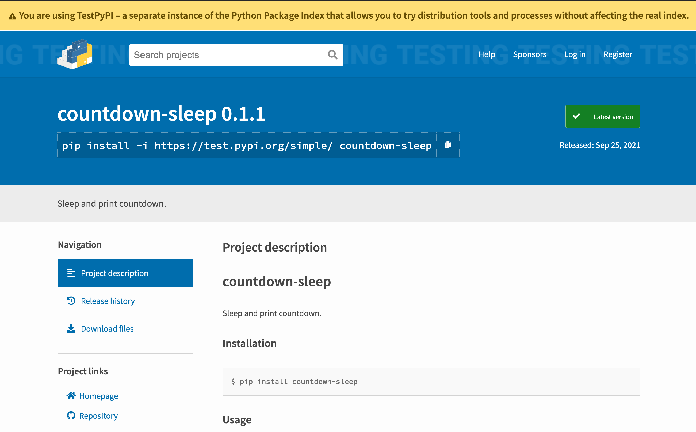
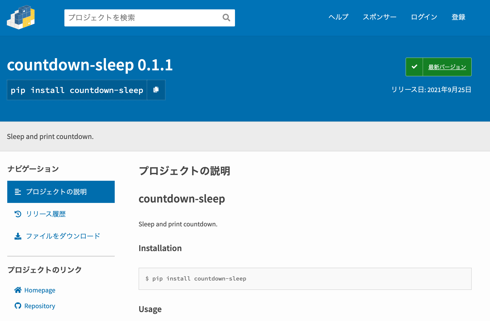

### **ゼロから始める Python パッケージ配布**

中村 優 / @chanyou0311

---

# 中村 優


- ちゃんゆー / @chanyou0311
- 2019年 株式会社ガイアックス新卒入社
- データ分析基盤の構築、運用
- 地元の広島でフルリモートワーク
- 高専出身

---

## ゼロから始める Python パッケージ配布

- Python のパッケージを作ってみたよ
- パッケージを配布するまでの流れを紹介するよ

---


## どんなパッケージを作ったのか
countdown-sleep
- Sleep and print countdown.


---

## なぜ作ったのか

- countdown-sleep をシェルスクリプトで書いた話題が社内で盛り上がっていて、Python でも実装してみようと思ったから
- 元々これから作りたいパッケージがあって、その配布の練習になると思ったから

---

## Python パッケージ配布のステップ
- Poetry を使う

> Poetry is a tool for dependency management and packaging in Python.

- Python のパッケージマネージャ
  - アプリケーションの開発だけでなく、パッケージの開発にも便利に使える
  - npm や yarn に近い

---

## 基本は3ステップ
  - poetry new
    - プロジェクトを作成する
  - poetry build
    - パッケージをビルドする
  - poetry publish
    - パッケージを公開する

---

## ライセンスを決める

- ライセンスのないソフトウェアを他人が利用することはできない
- [Choose an open source license | Choose a License](https://choosealicense.com/)
- 今回は練習の意味合いが強かったので NYSL にしました
  - 煮るなり焼くなり好きにしろライセンス

---

## パッケージプロジェクトを作成する

- poetry new で雛形を作る

```
$ poetry new hello-world --src
Created package hello_world in hello-world
```

---

- こんな感じで作成される

```
$ tree hello-world
hello-world
├── README.rst
├── pyproject.toml
├── src
│   └── hello_world
│       └── __init__.py
└── tests
    ├── __init__.py
    └── test_hello_world.py

3 directories, 5 files
```

---

## パッケージを作成する

- 最初に poetry install を実行して、仮想環境を作っておく
- poetry add <package_name> で依存するパッケージを追加できる

---

```python
import argparse
import time

def countdown_sleep(second: int):
    # check second is natural number (contains 0)
    if not isinstance(second, int) or second < 0:
        raise ValueError("'second' should be a natural number (contains 0). second: %s" % second)

    # countdown
    for i in range(second, 0, -1):
        print(f"\b \b\r{i}", end="", flush=True)
        time.sleep(1)


def cli():
    parser = argparse.ArgumentParser(description='Sleep and print countdown.')
    parser.add_argument('second', type=int, help='sleep seconds')
    args = parser.parse_args()
    countdown_sleep(args.second)

```

---

## パッケージをテストする

- 雛形に pytest が入っている

```
$ poetry run pytest
================================== test session starts ===================================
platform darwin -- Python 3.9.4, pytest-5.4.3, py-1.10.0, pluggy-0.13.1
rootdir: ...
collected 1 item

tests/test_hello_world.py .                                                        [100%]

=================================== 1 passed in 0.01s ====================================
```

---

```python
@patch("time.sleep", return_value=None)
def test_print_countdown_0(mock_sleep):
    n = 0
    expect_output = ""

    with captured_stdout() as stdout:
        countdown_sleep(n)

    assert stdout.getvalue() == expect_output

@patch("time.sleep", return_value=None)
def test_call_sleep_10_times(mock_sleep):
    n = 10
    countdown_sleep(n)
    assert mock_sleep.call_count == 10


@patch("time.sleep", return_value=None)
def test_raise_value_error_negative_1(mock_sleep):
    n = -1
    with pytest.raises(ValueError):
        countdown_sleep(n)
```

---

## いい感じ

```
poetry run pytest
================================== test session starts ===================================
platform darwin -- Python 3.9.4, pytest-6.2.5, py-1.10.0, pluggy-1.0.0
rootdir: ...
collected 7 items                                                                        

tests/test_countdown_sleep.py .......                                              [100%]

=================================== 7 passed in 0.06s ====================================
```

---

## パッケージの公開に必要な情報を記入する

- ライセンスを明示したテキストファイルを作成する
  - LICENSE や LICENSE.md、 LICENSE.txt といったファイルに内容を記入する

---

- pyproject.toml にパッケージの名前や説明、バージョンなどを記入する

```
[tool.poetry]
name = "countdown-sleep"
version = "0.1.1"
readme = "README.md"
description = "Sleep and print countdown."
license = "NYSL"
include = ["CHANGELOG.md"]
homepage = "https://github.com/chanyou0311/countdown-sleep"
repository = "https://github.com/chanyou0311/countdown-sleep"
authors = ["chanyou0311 <chanyou0311@gmail.com>"]
```

---

## パッケージをビルドする

```
$ poetry build
Building hello-world (0.1.0)
  - Building sdist
  - Built hello-world-0.1.0.tar.gz
  - Building wheel
  - Built hello_world-0.1.0-py3-none-any.whl
```

---

## パッケージを公開する

- まずは TestPyPI に公開する
  - いきなり本番の PyPI サーバーに公開せずに、テストサーバー [TestPyPI · The Python Package Index](https://test.pypi.org/) で公開してみる
- 事前に TestPyPI のアカウントを作成しておく
- TestPyPI の設定を行う

```
$ poetry config repositories.testpypi https://test.pypi.org/legacy/
$ poetry config http-basic.testpypi <USERNAME> <PASSWORD>
```

---

## TestPyPI に公開する

```
$ poetry publish -r testpypi
```

---

## TestPyPI で公開されているか確認する

- https://test.pypi.org/project/countdown-sleep/



---

## 正しくインストールできるか確認する

```
$ pip install --extra-index-url https://test.pypi.org/simple/ countdown-sleep
Looking in indexes: https://pypi.org/simple, https://test.pypi.org/simple/
Collecting countdown-sleep
  Using cached countdown_sleep-0.1.1-py3-none-any.whl (3.2 kB)
Installing collected packages: countdown-sleep
Successfully installed countdown-sleep-0.1.1
```

---

## 使えた :tada:

```
$ countdown_sleep --help
usage: countdown_sleep [-h] second

Sleep and print countdown.

positional arguments:
  second      sleep seconds

optional arguments:
  -h, --help  show this help message and exit
```

---

## PyPI に公開する

- TestPyPI と同様に、事前に PyPI のアカウントを作成しておく

```
$ poetry config http-basic.pypi <USERNAME> <PASSWORD>
```

```
$ poetry publish
```

---

## PyPI で公開されているか確認する

- https://pypi.org/project/countdown-sleep/



---

## わいわい

```
$ pip install countdown-sleep
Collecting countdown-sleep
  Using cached countdown_sleep-0.1.1-py3-none-any.whl (3.2 kB)
Installing collected packages: countdown-sleep
Successfully installed countdown-sleep-0.1.1
```

---

## LGTM

```
$ countdown_sleep --help
usage: countdown_sleep [-h] second

Sleep and print countdown.

positional arguments:
  second      sleep seconds

optional arguments:
  -h, --help  show this help message and exit
```

---

## まとめ

- Python でパッケージ作って配布することができた
- Poetry のおかげで簡単に行うことができた
- まずは自分の役に立つ小さなライブラリを作って、公開してみよう！
