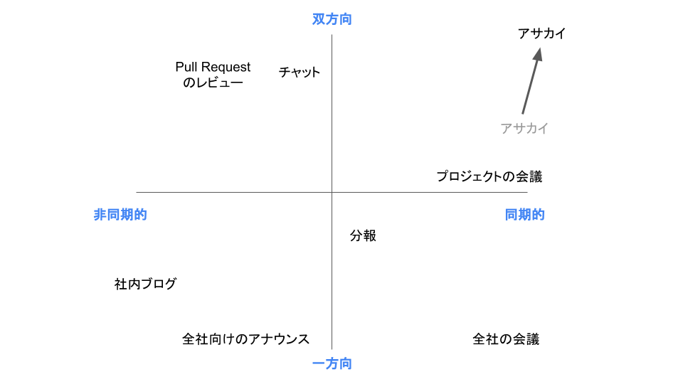
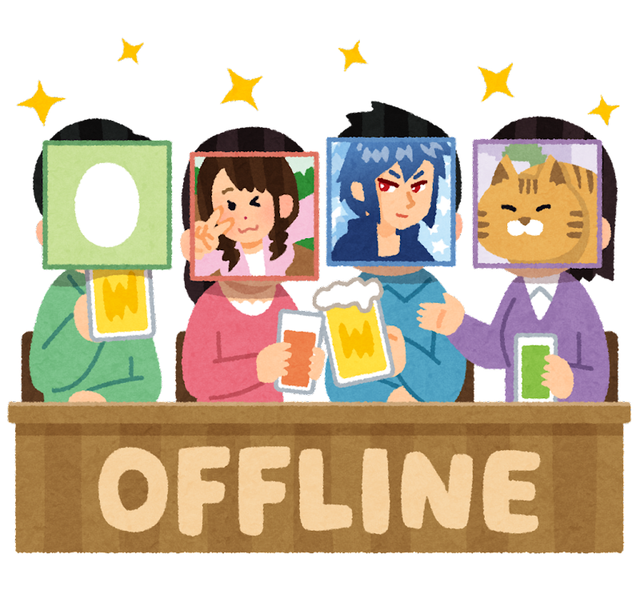

#### **オンラインコミュニケーションの課題と、その乗り越え方**

中村 優 / @chanyou0311

---

# 中村 優

- ちゃんゆー / @chanyou0311
- 広島出身広島在住のエンジニア、高専出身
- お仕事はデータ分析基盤の構築、運用
- 趣味はクルマと工作

---

# PyCon JP 2022 を10月に開催します

---

# PyCon JP 2022

- 日程: 10/14(金) から 10/16(日) まで
- 会場: TOC有明コンベンションホール
- ウェブサイト: https://2022.pycon.jp
- connpass よりお申込みください！

---

<!-- _class: gaia lead -->

#### オンラインコミュニケーションの課題と、その乗り越え方

---

# 今日お話すること

- オンラインコミュニケーションの課題とは？
- オンラインコミュニケーションの課題の乗り越え方

---

# ⚠ 注意

- 学術的な裏付けや根拠はなく、自身の経験と推測に基づいた解釈をお話します。
- 「そういう見方もあるかも」くらいで、さらっと聞いてもらえると嬉しいです。

---

# 今日お話しないこと

- リモートワークのメリット
- リモートワークのコツ

あえて今日は触れません！

---

<!-- _class: gaia lead -->

## オンラインコミュニケーションの課題とは？

---

### あらゆる状況において、**情報の偏り**を生んでしまう

--- 

### あらゆる状況において、**情報の偏り**を生んでしまう

- 個人
- チーム
- 組織全体

---

### 日々インプットする情報に偏りが出てしまう

- 読んだ書籍、チェックしているニュースサイト等が偏ってしまう

---

### 日々インプットする情報に偏りが出てしまう

- 読んだ書籍、チェックしているニュースサイト等が偏ってしまう
- chanyou は普段 Python を書いているので関心がそちらに寄りがち
  - 一方で Ruby の動向は何もわからない

---

### 日々インプットする情報に偏りが出てしまう

- 読んだ書籍、チェックしているニュースサイト等が偏ってしまう
- chanyou は普段 Python を書いているので関心がそちらに寄りがち
  - 一方で Ruby の動向は何もわからない
- 重要な情報を見逃しているかも…

---

### 社内メンバーのスキルや人間関係がわからない

- 組織に長くいればいるほど、誰と誰が一緒に仕事していたか把握できる

---

### 社内メンバーのスキルや人間関係がわからない

- 組織に長くいればいるほど、誰と誰が一緒に仕事していたか把握できる
- 新しくリモートの組織に入ると、今の状況はわかっても過去のことを把握するのは困難

---

### 社内メンバーのスキルや人間関係がわからない

- 組織に長くいればいるほど、誰と誰が一緒に仕事していたか把握できる
- 新しくリモートの組織に入ると、今の状況はわかっても過去のことを把握するのは困難
  - 今のプロダクトオーナーが、実は以前テックリードとして働いていてバリバリコード書けたとか
  - リモートだとなぜか過去の話題になりにくい

---

### チームの仕事が属人化してしまう
- 「この仕事はあの人が前やったから、今回もお願いしよう」

---

### チームの仕事が属人化してしまう
- 「この仕事はあの人が前やったから、今回もお願いしよう」
- ドキュメント化されない秘伝の知見がその人に閉じてしまう

---

### チームの仕事が属人化してしまう
- 「この仕事はあの人が前やったから、今回もお願いしよう」
- ドキュメント化されない秘伝の知見がその人に閉じてしまう
- オフィスだと教えてもらうきっかけを作りやすいのに…

---

### チームの動きが局所最適化されてしまう

- コミュニケーションがチーム内に閉じてしまうと、社内であっても他のチームがどんなことをやっているかわからない

---

### チームの動きが局所最適化されてしまう

- コミュニケーションがチーム内に閉じてしまうと、社内であっても他のチームがどんなことをやっているかわからない
- 似たような調査や課題解決を、別のチームがそれぞれやってしまうことも
  - 同じ轍を踏む…

--- 

### **情報の偏り**が様々な弊害を及ぼす

- 個人
  - 日々インプットする情報に偏りが生じてしまう
  - 社内の人間関係の経緯を把握するハードルが高い
- チーム
  - チームの仕事が属人化してしまう
- 組織全体
  - チームの動きが局所最適化されてしまう

---

<!-- _class: gaia lead -->

## 情報の偏りの性質と原因

---

#### 情報の偏り自体はリモートワークと関係なく生じてしまうもの

リモートワークだと顕著に出やすい印象

---

### **情報の偏り**の原因はなんだろう…？

---

色々考えたり経験した結果…

### 結局は「雑談不足」が原因

もう少しロジカルに考えてみる

---

## コミュニケーションを分類して考えてみる

---

### 同期的かどうか、双方向か一方向かで分類できそう

---

### オフラインでのコミュニケーションを考えてみる

---

### オンラインでのコミュニケーションを考えてみる

同期的で双方向のコミュニケーションが少ない…

---

# オフライン / オンライン

 

---

 

#### 同期的な双方向コミュニケーションが貴重…！
#### 貴重な時間を雑談に使いにくい

---

# 情報の偏りの原因

- 雑談不足が情報の偏りを大きくしてしまう
  - ふとした会話が知識の共有や組織改善のきっかけにつながる

---

# 情報の偏りの原因

- 雑談不足が情報の偏りを大きくしてしまう
  - ふとした会話が知識の共有や組織改善のきっかけにつながる
- 雑談が不足するのは「同期的な双方向コミュニケーション」が貴重だから
  - 雑談は後回しにして、本題に入ってしまう

---

<!-- _class: gaia lead -->

### オンラインコミュニケーションの課題の乗り越え方

---

# 雑談増やせばいいんでしょ？

でも、いきなり雑談してくださいと言われても…

---

#### 原因を逆手に取ると、
#### 同期的な双方向コミュニケーションが雑談を生みやすい

---

### 同期的な双方向コミュニケーションを
### 戦略的に増やしていこう

---

## やってよかった施策の紹介

---

## モブプロ・ペアプロの実践

---

## モブプロ・ペアプロの実践

---

## モブプロ・ペアプロの実践

どういうときにモブプロ・ペアプロをやるのかチームで決めておくのがおすすめ

- 初回リリースまでは意思決定が多いのでモブプロで行う
- 30分やって原因がわからないバグがあれば、ペアプロを行う
- 常にモブプロを実践する

---

## アサカイで1人1ネタ、
## 気になったニュースと見解を共有する

---

## アサカイでニュース共有

---

## 双方向を意識したコミュニケーション

アサカイに限らず、ちょっとした工夫で双方向要素を加えられる

---

## 究極的にはオフラインで会う

---

## 究極的にはオフラインで会う

---

## 究極的にはオフラインで会う

会社の規模やオフィスと自宅の距離によりますが、以下のペースで会うことが多い

- チームメンバーとは1〜2ヶ月に1回程度
- 部署単位だと四半期に1回程度
- 会社全体だと年に1回程度

---

## オフラインで会って何をするか

特に以下のような場合に、積極的にオフラインで会うようにしている

- 中長期のロードマップを計画するとき
- チームや組織全体に影響する根深い問題に気づいたとき

通常業務をなるべく入れずに、今後の方針策定などにじっくり時間を使うことが多い

---

## やってよかった施策の紹介

- 同期的な双方向コミュニケーションの場を設ける
  - モブプロ・ペアプロ

---

## やってよかった施策の紹介

- 同期的な双方向コミュニケーションの場を設ける
  - モブプロ・ペアプロ
- 既存のコミュニケーションに双方向の要素を加える
  - アサカイでニュース共有

---

## やってよかった施策の紹介

- 同期的な双方向コミュニケーションの場を設ける
  - モブプロ・ペアプロ
- 既存のコミュニケーションに双方向の要素を加える
  - アサカイでニュース共有
- オフラインで顔を合わせる機会を設ける
  - ロードマップ策定、開発合宿、社内LT大会

---

<!-- _class: gaia lead -->

# まとめ

---

## まとめ

- オンラインコミュニケーションの課題とは？
  - 雑談不足が**情報の偏り**を生み、様々な弊害をもたらす

---

## まとめ

- オンラインコミュニケーションの課題とは？
  - 雑談不足が**情報の偏り**を生み、様々な弊害をもたらす
  - 雑談不足なのは同期的な双方向コミュニケーションが貴重だから

---

## まとめ

- オンラインコミュニケーションの課題の乗り越え方
  - 雑談を増やす、同期的な双方向コミュニケーションを増やす

---

## まとめ

- オンラインコミュニケーションの課題の乗り越え方
  - 雑談を増やす、同期的な双方向コミュニケーションを増やす
    - モブプロ・ペアプロ
    - アサカイでニュース共有
    - オフラインで会う

---

### 日々のコミュニケーションを整理してみると、
### 不足しがちなコミュニケーションに気づけるかも？

ぜひやってみてください！
