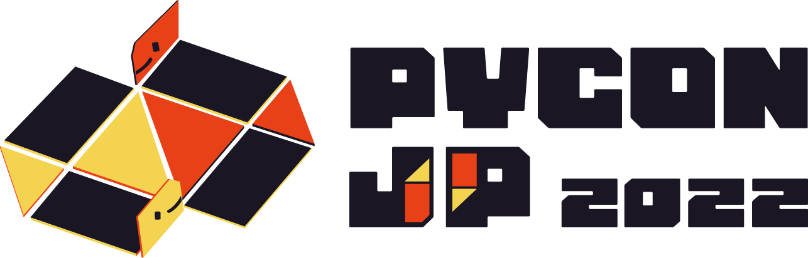

#### **オンラインコミュニケーションの課題と、その乗り越え方**

中村 優 / @chanyou0311

---

# 中村 優

- ちゃんゆー / @chanyou0311
- 広島出身広島在住のエンジニア、高専出身
- お仕事はデータ分析基盤の構築、運用
- 趣味はクルマと工作

---

# PyCon JP 2022 を10月に開催します

---

# PyCon JP 2022

- 日程: 10/14(金) から 10/16(日) まで
- 会場: TOC有明コンベンションホール
- ウェブサイト: https://2022.pycon.jp
- connpass よりお申込みください！

---

<!-- _class: gaia lead -->

#### オンラインコミュニケーションの課題と、その乗り越え方

---

# 今日お話すること

- オンラインコミュニケーションの課題とは？
- オンラインコミュニケーションの課題の乗り越え方

---

# ⚠ 注意

- 学術的な裏付けや根拠はなく、自身の経験と推測に基づいた解釈をお話します。
- 「そういう見方もあるかも」くらいで、さらっと聞いてもらえると嬉しいです。

---

# 今日お話しないこと

- リモートワークのメリット
- リモートワークのコツ

あえて今日は触れません！

---

<!-- _class: gaia lead -->

## オンラインコミュニケーションの課題とは？

---

### あらゆる状況において、**情報の偏り**を生んでしまう

--- 

### あらゆる状況において、**情報の偏り**を生んでしまう

- 個人
- チーム
- 組織全体

---

### 日々インプットする情報に偏りが出てしまう

- 読んだ書籍、チェックしているニュースサイト等が偏ってしまう
- chanyou は普段 Python を書いているので関心がそちらに寄りがち
  - 一方で Ruby の動向は何もわからない
- 重要な情報を見逃しているかも…

---

### 社員の過去の経緯を把握するハードルが高い

- 組織に長くいればいるほど、誰と誰が一緒に仕事していたか把握できる
- 新しくリモートの組織に入ると、今の状況はわかっても過去のことを把握するのは困難
  - 今のプロダクトオーナーが、実は以前テックリードとして働いていてバリバリコード書けたとか
- リモートだとなぜか過去の話題になりにくい

---

### チームの仕事が属人化してしまう
- 「この仕事はあの人が前やったから、今回もお願いしよう」
- ドキュメント化されない秘伝の知見がその人に閉じてしまう
- オフィスだと教えてもらうきっかけを作りやすいのに…

---

### チームの動きが局所最適化されてしまう
- コミュニケーションがチーム内に閉じてしまうと、社内であっても他のチームがどんなことをやっているかわからない
- 似たような調査や課題解決を、別のチームがそれぞれやってしまうことも
  - 同じ轍を踏む…

--- 

### あらゆる状況において、**情報の偏り**を生んでしまう

- 個人
  - 日々インプットする情報に偏りが生じてしまう
  - 社内の人間関係の経緯を把握するハードルが高い
- チーム
  - チームの仕事が属人化してしまう
- 組織全体
  - チームの動きが局所最適化されてしまう

---

<!-- _class: gaia lead -->

## 情報の偏りの性質と原因

---

#### 情報の偏り自体はリモートワークに関係なく生じてしまうもの

リモートワークだと顕著に出やすい印象

---

### **情報の偏り**の原因はなんだろう…？

---

# 情報の偏りの原因

**同期的な双方向コミュニケーションの場の不足**

と説明できそう

---

## コミュニケーションを分類して考えてみる

---

### 同期的かどうか、双方向か一方向かで分類できそう

---

### オフラインでのコミュニケーションを考えてみる

---

### こういった傾向にありそう

---

### オンラインでのコミュニケーションを考えてみる

同期的で双方向のコミュニケーションが少ない…

---

# オフライン / オンライン

 

- 対面だと同期的で双方向コミュニケーション中心となる
- リモートワークだと同期と非同期の両方でコミュニケーションを取る必要がある

---

## コミュニケーションと情報の偏りの関係性

- 同期的な双方向コミュニケーションの時に、情報の偏りを是正する情報共有が行われやすい
- 逆に、情報の偏りは**同期的な双方向コミュニケーションが不足したとき**に生じるのではないか？
  - いわゆる雑談不足

---

# 情報の偏りの原因

**同期的な双方向コミュニケーションの場の不足**

と説明できそう

---

<!-- _class: gaia lead -->

### オンラインコミュニケーションの課題の乗り越え方

---

### 同期的な双方向コミュニケーションを充実させると、
### 情報の偏りを解消できそう

---

### 同期的な双方向コミュニケーションを充実させる方法

1. 同期的な双方向コミュニケーションの場を習慣的に設ける
2. 既存のコミュニケーションに双方向の要素を加える
3. 定期的にオフラインで顔を合わせる機会を設ける

---

#### 1. 同期的な双方向コミュニケーションの場を習慣的に設ける

- モブプロ・ペアプロを実施する
- アサカイを実施する

---

#### 1. 同期的な双方向コミュニケーションの場を習慣的に設ける

---

### 2. 既存のコミュニケーションに双方向の要素を加える

- アサカイで1人1ネタ、気になったニュースと見解を共有する
- 他人の書いた社内ブログにコメントを書く
- チャットで積極的にリアクションを付ける
- 分報で軽く議論をする

---

### 2. 既存のコミュニケーションに双方向の要素を加える

---

### 3. 定期的にオフラインで顔を合わせる機会を設ける

- 開発合宿を実施する
- 飲み会や社内交流会を開催する

リモートワークでまかなえないコミュニケーションは、対面で補う

---

### 同期的な双方向コミュニケーションを充実させる方法

1. 同期的な双方向コミュニケーションの場を習慣的に設ける
2. 既存のコミュニケーションに双方向の要素を加える
3. 定期的にオフラインで顔を合わせる機会を設ける

---

<!-- _class: gaia lead -->

# まとめ

---

## まとめ

- オンラインコミュニケーションの課題とは？
  - あらゆる状況において、**情報の偏り**を生んでしまう
- オンラインコミュニケーションの課題の乗り越え方
  - 同期的な双方向コミュニケーションを充実させる

---

### 日々のコミュニケーションを整理してみると、
### 不足しがちなコミュニケーションに気づけるかも？

ぜひやってみてください！
